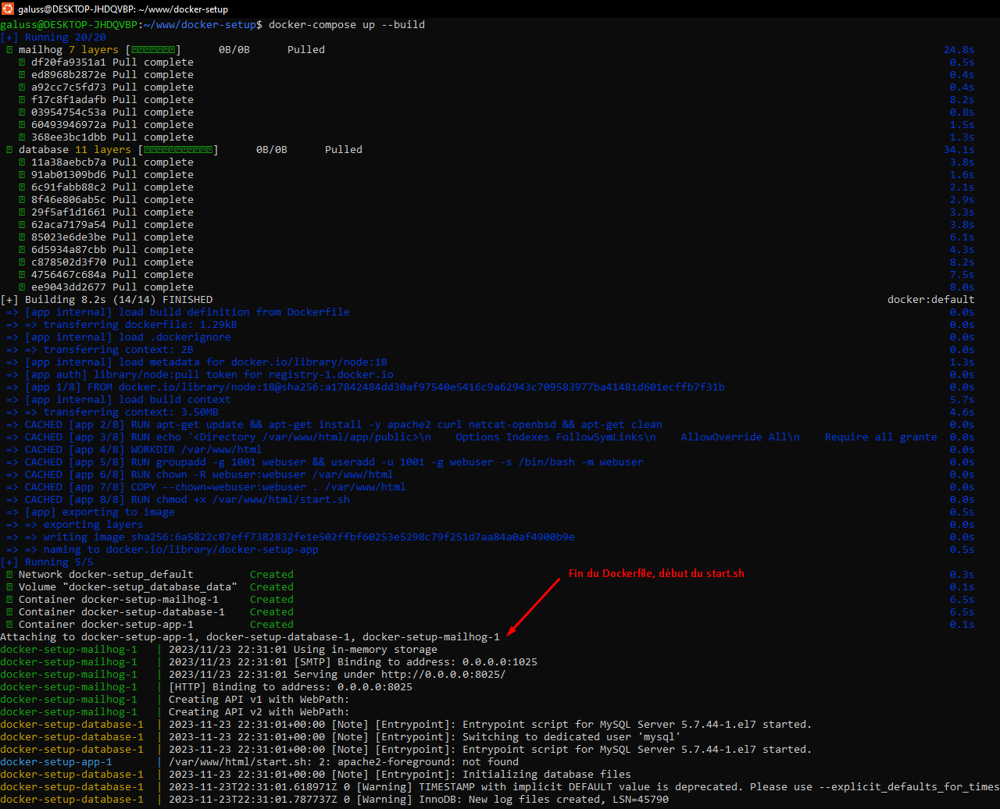

# Environnement Docker

## Introduction
Après avoir configuré WSL2 et Docker Desktop, il est important de comprendre comment utiliser efficacement cet environnement pour le développement. Ce guide se concentre sur l'utilisation des fichiers Dockerfile, docker-compose.yml et d'un script de démarrage start.sh.

## Prérequis
- Docker Desktop doit être lancer
- Les fichiers Docker (Dockerfile, docker-compose.yml, etc) doivent être présents à la racine du projet

## Présentation

### Fichier Dockerfile
Le fichier "Dockerfile" est un script de configuration utilisé pour automatiser le processus de création d'une image Docker. Il contient une série d'instructions pour installer des logiciels, copier des fichiers, et configurer des paramètres.
```bash
# Utilisez une image Node.js officielle avec Apache
FROM node:18

# Installez les dépendances système + Apache
RUN apt-get update && apt-get install -y apache2 curl netcat-openbsd && apt-get clean

# Configuration Apache pour servir l'application React depuis /var/www/html/app/public
RUN echo '<Directory /var/www/html/app/public>\n\
    Options Indexes FollowSymLinks\n\
    AllowOverride All\n\
    Require all granted\n\
</Directory>' > /etc/apache2/sites-available/000-default.conf

# Définir le répertoire de travail
WORKDIR /var/www/html

# Variables utilisateurs
ARG UID=1001
ARG GID=1001

# Créer un utilisateur webuser avec les UID et GID spécifiés
RUN groupadd -g ${GID} webuser && useradd -u ${UID} -g webuser -s /bin/bash -m webuser

# Changer le propriétaire du répertoire de travail pour webuser
RUN chown -R webuser:webuser /var/www/html

# Copier les fichiers de l'application dans le répertoire de travail avec les bonnes permissions
COPY --chown=webuser:webuser . /var/www/html

# Permission pour éxécuter le script de démarrage
RUN chmod +x /var/www/html/start.sh

# Exécuter le script de démarrage
CMD ["sh", "/var/www/html/start.sh"]

# Utiliser l'utilisateur webuser
USER webuser
```

### Fichier docker-compose.yml
Le fichier docker-compose.yml est utilisé pour définir et exécuter des applications multi-conteneurs avec Docker. Il permet de configurer les services, les volumes, les réseaux, etc.\
Dans notre cas ce fichier permet également d'initialiser la base de données présente dans le fichier "init-db.sql".
```yml
version: '3.8'
services:
  app:
    build:
      context: .
      dockerfile: Dockerfile
    ports:
      - 3000:3000
    volumes:
      - .:/var/www/html
    env_file:
      - .env
    depends_on:
      - database
      - mailhog

  database:
    image: mysql:5.7
    volumes:
      - database_data:/var/lib/mysql
      - ./init-db.sql:/docker-entrypoint-initdb.d/init-db.sql
    ports:
      - 3310:3306
    env_file:
      - .env

  mailhog:
    image: mailhog/mailhog
    ports:
      - 8025:8025

volumes:
  database_data: {}
```

### Fichier start.sh
Le script start.sh est utilisé pour initialiser et démarrer l'environnement de développement.\
Note : Le nom de ce script est personnalisable, il suffit juste de l'appeller correctement depuis le fichier Dockerfile.
```bash
# Démarrer Apache en arrière-plan
apache2-foreground &

# Laisser le temps à Apache de démarrer
sleep 5

# Attendre le démarrage de MySQL
until nc -z -v -w30 database 3306
do
  echo "start.sh : Waiting for MySQL to start to continue"
  sleep 5
done

# Log un message pour indiquer le démarrage de MySQL
echo "start.sh : MySQL started"

# Changer de répertoire vers /var/www/html/app
cd /var/www/html/app

# Installer les dépendances de l'application React
npm install

# Démarrer l'application React avec npm start
npm start &

# Vérifier que l'application React est démarrée
until curl -s http://localhost:3000
do
  echo "start.sh : Waiting for the application to start to continue"
  sleep 5
done

# Log un message pour indiquer le démarrage de l'application
echo "start.sh : Application started"

# Log un message pour indiquer la fin du script
echo "start.sh : End of script execution, container ready"

# Maintenir le conteneur actif
tail -f /dev/null
```

## Utilisation
Pour construire l'image Docker, éxécuter la commande ci-dessous depuis la racine du projet contenant les fichiers Docker.
```bash
docker-compose up --build
```
L'image Docker va alors être installer grâce aux fichiers "Dockerfile" et "docker-compose.yml" puis le conteneur sera initialisé grâce au fichier "start.sh".


Une fois l'installation terminé :
- L'application est accessible depuis http://localhost:3000
- La base de données est accessible depuis localhost:3310
- Un "service mailer" (mailhog) est également mis en place et accessible depuis http://localhost:8025/

Vous pouvez ensuite utiliser les commandes ci-dessous pour démarrer/arrêter les conteneurs sans lancer de build.
```bash
docker-compose up
```
```bash
docker-compose down
```

Les conteneurs, images, volumes sont également accessibles depuis Docker Desktop.\
Depuis les conteneurs vous pourrez accéder aux terminaux, logs, fichiers, etc.\


## Libérer de l'espace
L'environnement Docker peux rapidement devenir encombrant, surtout si vous avez plusieurs images/projets.\
Vous pouvez supprimer les conteneurs, images et volumes directement depuis Docker Desktop, vous pouvez également utiliser les commandes ci-dessous.\
<br>
Supprimer les images non utilisées
```bash
docker image prune
```
Supprimer les conteneurs inactifs
```bash
docker container prune
```
Supprimer les volumes non utilisés
```bash
docker volume prune
```
Nettoyage global
```bash
docker system prune -a
```
Nettoyer le cache du builder
```bash
docker builder prune
```

## Autres commandes utiles
Utiliser le flag "-d" afin d'éxécuter les commandes en "fond" et maintenir le terminal utilisable
```bash
docker-compose up -d 
docker-compose up --build -d
```
Lancer un build sans cache 
```bash
docker-compose build --no-cache
```
Exécuter un conteneur
```bash
docker run -p 3000:3000 <container_name>
```
Arrêter un conteneur
```bash
docker stop <container_id>
```
Lister les conteneurs
```bash
docker ps
```
Supprimer un conteneur
```bash
docker rm <container_id>
```
Supprimer une image
```bash
docker rmi <image_name>
```
Nettoyer le terminal
```bash
clear
```

## Astuces
- Forcer l'arrêt du conteneur depuis le terminal Ubuntu : Ctrl+Shift+C
- Coller depuis le terminal Ubuntu : Clic droit
- Coller depuis le terminal conteneur Docker App : Ctrl+Shift+V
- Récupérer les commandes précédente dans le terminal Ubuntu : Flèche directionnel haut

## Conclusion
L'utilisation efficace de Docker avec WSL2 peut considérablement améliorer votre workflow de développement. En comprenant et en utilisant correctement les fichiers Dockerfile, docker-compose.yml et start.sh, vous pouvez créer un environnement de développement robuste, répétable et portable.