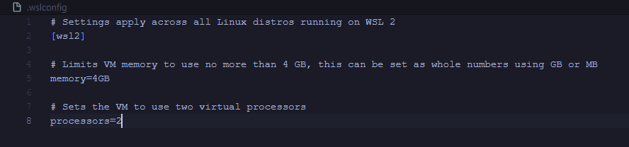

# Environnement Docker

## Introduction
...

### Prérequis
- Les fichiers Dockerfile et docker-compose.yml contenant les instructions d'installation sont présents à la racine du projet.
- L'application Docker Desktop est correctement lancée.

### Build
Depuis le terminal Ubuntu, à la racine du projet souhaité exécuter la commande ci-dessous pour build l'environnement Docker.
```bash
docker-compose up --build -d
```
*La commande **docker-compose up** permet de démarrer l'environnement Docker.*\
*Le flag **--build** permet de préciser que l'on souhaite build l'environnement, à exécuter à chaque fois qu'une modification est effectée dans le fichier Dockerfile ou docker-compose.yml*\
*Le flag **-d** permet de lancer la commande en "fond" afin que le terminal puisse toujours être utilisé après la fin du build. Il est parfois pertinent de retirer ce flag pour avoir accès aux logs de démarrage si on ne peut pas y accéder depuis les conteneurs.*



L'environnement Docker et les dépendances du projet ont été installés.\
Il faut peut-être attendre quelques instants pour laisser le temps aux commandes npm de finir leur exécution, pour info les commandes sont appelées automatiquement lors du build depuis le script "start.sh" lui-même appelé dans le fichier Dockerfile.\
Le projet est maintenant accessible depuis http://localhost:3000


### Conteneurs
Les conteneurs sont disponibles depuis Docker Desktop et contiennent chacun de nos services.\
*Pour info chaque service est listé dans le fichier docker-compose.yml*


Quelques exemples des possibilités avec le conteneur App qui contient l'application React du tuto :
- Les logs sont disponibles, on peut par exemple voir les commandes npm install et npm start exécutées automatiquement avec notre script start.sh


- Le terminal est disponible nous permettant d'exécuter des commandes propres au projet.


#### Démarrage/Arrêt des conteneurs
*Depuis le terminal Ubuntu, à la racine du projet contenant les fichiers Dockerfile et docker-compose.yml*
```bash
docker-compose up -d
```
```bash
docker-compose down
```
*Si le terminal Ubuntu est crash empêchant de faire un docker-compose down, essayer de faire Ctrl+Shift+C*\
*Si des modifications ont été faites dans les fichiers Dockerfile et docker-compose.yml, ajouter le flag --build*
```bash
docker-compose up --build -d
```

### Base de données
La base de données "my_database" a été créer automatiquement lors du build de l'environnement Docker grâce aux fichiers docker-compose.yml et init-db.sql\
Les informations de connexion (username/password) sont présentes dans le fichier .env\
La connexion se fait depuis localhost:3310 lorsque l'on se connecte depuis l'extérieur (par exemple pour se connecter à un outil comme DBeaver ou HeidiSQL, c'est en extérieur).\
La connexion se fait par database:3306 lorsque l'on se connecte en interne (par exemple pour connecter notre application React à notre base de données, c'est en interne).


## Permissions
Il y a parfois des problèmes de permissions que je n'arrive pas encore à anticiper.

Quelques exemples de problèmes rencontrés à cause des permissions :
- Après avoir lancé la commande npm install le dossier node_modules est bien créé mais il est vide.
- Impossible de sauvegarder les modifications dans un fichier.
- Impossible de supprimer un fichier/dossier.

Corriger les problèmes de permissions avec les commandes ci-dessous dans les terminaux Ubuntu et conteneur Docker App.

*Afficher la liste des fichiers/dossiers avec le nom du propriétaire et le niveau de permission*
```bash
ls -l
```
*Supprimer le fichier/dossier souhaité.*\
*Cette commande s'utilise dans le terminal Ubuntu uniquement.*
```bash
sudo rm -R à-supprimer
```
*L'utilisateur username devient propriétaire du dossier courant.*\
*Ajouter sudo est nécessaire dans le terminal Ubuntu uniquement.*\
*Dans le conteneur Docker App le dossier courant est probablement /var/www/html et l'utilisateur est probablement www-data*
```bash
sudo chown -R username:username .
```
*L'utilisateur actuel possède désormais tous les droits du dossier courant.*\
*Ajouter sudo est nécessaire dans le terminal Ubuntu uniquement.*\
*Dans le conteneur Docker App le dossier courant est probablement /var/www/html et l'utilisateur est probablement www-data*
```bash
sudo chmod -R 775 .
```

## Astuces
- Coller dans le terminal Ubuntu : Clic droit
- Coller dans le terminal conteneur Docker App : Ctrl+Shift+V
- Récupérer commande précédente dans le terminal Ubuntu : Flèche directionnel haut
- Un service mailer (mailhog) est en place sur l'environnement Docker et accessible depuis http://localhost:8025/
- Parfois le conteneur database ne démarre pas correctement la première fois, il faut le démarrer manuellement depuis Docker Desktop -> Containeurs
- Si les commandes sudo ne fonctionnent pas sur Ubuntu, suivez ce [guide](https://www.it-connect.fr/commande-sudo-comment-configurer-sudoers-sous-linux/)
