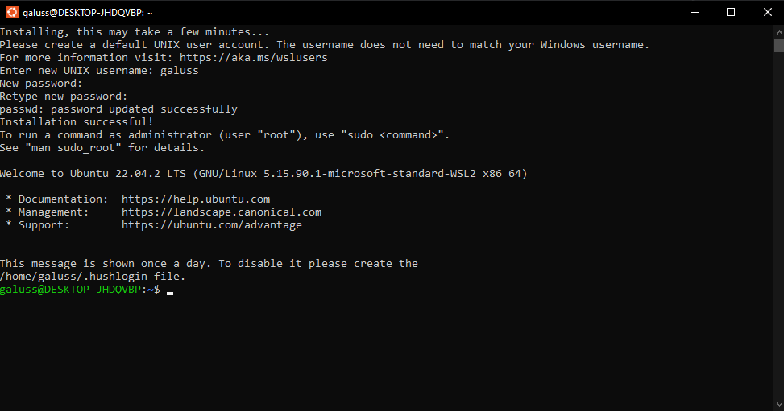
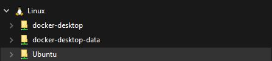

# Mise en place Docker

## Introduction
Docker est un outil de conteneurisation qui permet aux développeurs de créer, déployer et exécuter des applications dans des environnements isolés appelés conteneurs. Il offre une grande portabilité et assure la consistance entre les environnements de développement et de production, simplifiant ainsi le processus de développement dans un projet informatique.

## Prérequis
- Installer [Docker Desktop](https://www.docker.com/products/docker-desktop/)
- Installer une distribution Linux (par exemple Ubuntu depuis le Microsoft Store, installation en ligne de commande également possible)
- Activer la fonctionnalité Windows "Plateforme de machine virtuelle" puis redémarer le PC (Pannneau de configuration -> Programmes -> Activer ou désactiver des fonctionnalités Windows)

## Installation

### Configuration de la distribution Linux
Lors du premier lancement l'environnement doit s'installer correctement.

L'environnement est désormais accessible depuis l'explorateur de fichiers Windows ("\\wsl.localhost\Ubuntu").
\
Créer un dossier de travail "home/username/www".\


### Mettre à jour l'environnement 
```bash
sudo apt update
```
```bash
sudo apt upgrade -y
```
```bash
sudo apt autoremove
```
```bash
sudo apt clean
```

### Ajouter une configuration personnalisée à la fin du fichier "home/username/.bashrc"
```bash
# Alias navigation
alias ..="cd .."
alias ...="cd ../.."
alias ....="cd ../../.."
alias ll="ls -lah"
alias la="ls -lAh"
alias l="ls -CF"

# Alias Git
alias gs="git status"
alias gl="git log --oneline --all --graph --decorate  $*"
alias glist="git config –global –list"
alias ga="git add"
alias gc="git commit"
alias gpush="git push"
alias gpull="git pull"
alias gd="git diff"
alias gch="git checkout"

# Alias Docker
alias dcompose="docker-compose"
alias dcomposebuild="docker-compose up --build"
alias dcomposeup="docker-compose up"
alias dcomposeupd="docker-compose up -d"
alias dcomposedown="docker-compose down"
```

### Configuration Git
```bash
git config --global user.name "Username"
```
```bash
git config --global user.email "username@email.com"
```
```bash
git config --global init.defaultBranch main
```
```bash
git config --global color.ui auto
```
```bash
git config --global core.autocrlf input
```

### Clés SSH GitHub
[Suivre ce guide](https://kinsta.com/blog/generate-ssh-key/)

### Configuration VS Code
[Documentation](https://code.visualstudio.com/docs/remote/wsl-tutorial)\
Utilisation de l'extension WSL.\
Connexion au compte GitHub depuis VS Code pour synchroniser les settings.

